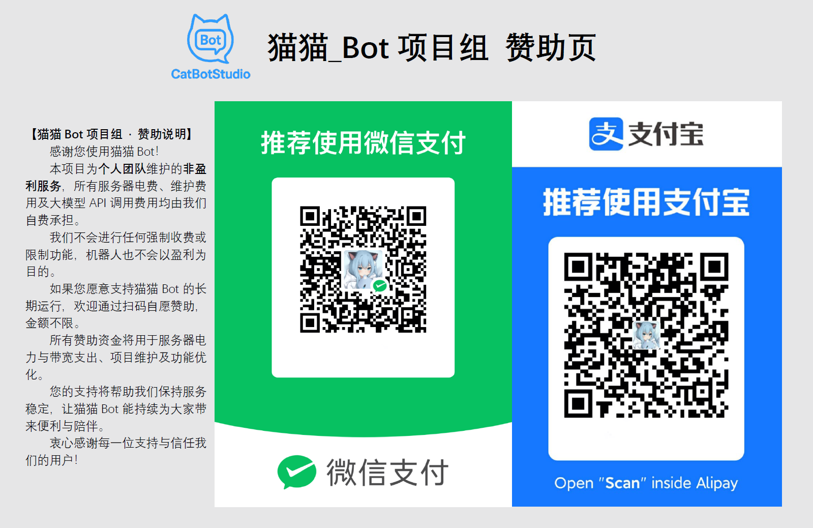
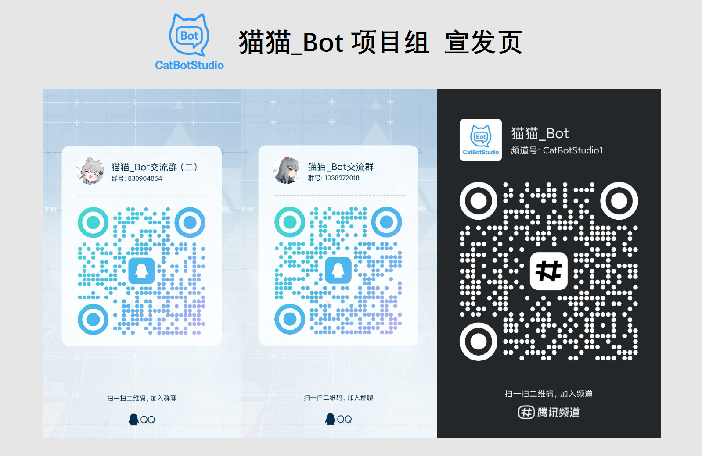

<div align="center">


[](https://github.com/DoomVoss/Koishi-Plugins-CBS/stargazers)
[](https://github.com/DoomVoss/Koishi-Plugins-CBS/blob/main/LICENSE)
[](https://github.com/DoomVoss/Koishi-Plugins-CBS/issues)
[](https://www.npmjs.com/~doomvoss)
[](https://qm.qq.com/q/oGwB5mKQtq)


</div>

# Koishi-Plugins-CBS

## 项目简介

Koishi-Plugins-CBS 是 Doom 在 **CatBotStudio** 开发的一系列 Koishi 插件集合，包括但不限于：
- Q群管理自动化（退群、消息处理、权限管理等）
- 日常交互增强（自定义回复、命令扩展、事件监听等）
- 插件兼容 Koishi v4 系列，易于安装和配置

本项目中，部分插件直接使用 JavaScript 编写，而非 TypeScript 编译。同时，也有部分插件使用 TypeScript 开发。

两者都支持 HMR 热重载，但在进行二次开发时，请根据插件的编写语言进行区分。


---

## QQ野生机器人应用实例

本项目组提供 QQ 野生机器人应用实例，用户可以通过该机器人直接体验本仓库中所有插件的功能。  

**体验方式：**

- 点击链接加入以下项目组机器人QQ群（任选其一即可，不限制同时加入多群）

> [猫猫_Bot交流一群](https://qm.qq.com/q/dkbbRhmDbW)
> [猫猫_Bot交流二群](https://qm.qq.com/q/Y5M84awDeu)

- 支持功能：群管理自动化、消息回复增强、命令扩展等本项目所有插件功能  
- 注意事项：请勿发送违规或破坏性指令，以免影响机器人正常运行

---

## 温馨提示

- 由于插件列表会持续更新，此处不列出所有插件说明文档，插件将陆续上传至该仓库及 npm。
- 例如，`dispose-group` 插件的说明文档位于： [plugins/dispose-group/readme.md](plugins/dispose-group/readme.md)
- 如果发现仓库代码与 npm 版本不一致，请以 npm 平台发布的版本为准。
- 发现 Bug 或有任何问题？ 欢迎[提交 Issue](https://github.com/DoomVoss/Koishi-Plugins-CBS/issues/new/choose)！
- 如果你发现本项目的 commit 长时间未更新，这意味着作者暂停了本项目的更新，并且不再维护。请自行判断项目的使用情况。

---

## 使用说明

- 该仓库内所有插件均同时发布于 npm ，可在 Koishi 插件市场内搜索到，直接安装使用即可。

---

## 开发者贡献指南

### 如何在项目模板中开发此仓库

1.  **创建项目模板**

    ```shell
    yarn create koishi
    ```

    回车确认，直到弹出 Koishi 的 WebUI。
    
    完成后在项目根目录执行 yarn 安装依赖。

2.  **进入项目模板根目录** 

    先在 Koishi 终端按下 `Ctrl + C` 退出项目模板，然后 `cd` 进入目录：

    ```shell
    cd koishi-app
    ```

3.  **克隆本仓库** 

    ```shell
    git clone https://github.com/DoomVoss/Koishi-Plugins-CBS.git
    ```

4.  **以开发模式启动** 
    
    ```shell
    yarn dev
    ```

5. 在本地开发插件或改进现有插件后，提交 [Pull Request](https://github.com/DoomVoss/Koishi-Plugins-CBS/pulls)，并确保代码风格与现有插件一致


### 发布 npm 包

本项目的贡献者可以在 `.publish/npmpublish` 目录下放置需要发布的 npm 包。

发布时，请确保将所有相关文件放在该目录中，确保目录结构如下:

**目录结构**

```shell
publish/
├── npmpublish/
│   ├── lib
│   ├── LICENSE.txt # 如存在则无需上传
│   ├── package.json
│   ├── readme.md
│   └── ...  # 其他需要发布的文件
└── npmpublish_temp/
    └── LICENSE.txt # 请勿改动
```

**注意**：在发布前请确保 `package.json` 的 `name` 字段不与已有 npm 包冲突，否则会触发 403 错误。

在 `npmpublish` 目录下，确保包含 `package.json` 和其他相关文件，以便顺利发布 npm 包。

具体实现效果 [请参见 .github 文件](.github/workflows/publish.yml)

---

## 支持与赞助

如果你觉得本项目对你有帮助，可以通过以下方式支持我们：

<div align="center">


<p>扫码赞助，支持猫猫_Bot持续开发运营</p>

</div>

---

## 联系

通过以下方式联系我们：

<div align="center">


<p>扫码二维码加入 官群 / 频道 </p>

</div>

---

## 许可协议

- 本项目采用 MIT 许可证，详情请参见 [LICENSE](./LICENSE) 文件

> **MIT License**
>
> Copyright (c) 2025 Doom
>
> Permission is hereby granted, free of charge, to any person obtaining a copy
> of this software and associated documentation files (the "Software"), to deal
> in the Software without restriction, including without limitation the rights
> to use, copy, modify, merge, publish, distribute, sublicense, and/or sell
> copies of the Software, and to permit persons to whom the Software is
> furnished to do so, subject to the following conditions:
>
> The above copyright notice and this permission notice shall be included in all
> copies or substantial portions of the Software.
>
> **免责声明**：
>
> THE SOFTWARE IS PROVIDED "AS IS", WITHOUT WARRANTY OF ANY KIND, EXPRESS OR
> IMPLIED, INCLUDING BUT NOT LIMITED TO THE WARRANTIES OF MERCHANTABILITY,
> FITNESS FOR A PARTICULAR PURPOSE AND NONINFRINGEMENT. IN NO EVENT SHALL THE
> AUTHORS OR COPYRIGHT HOLDERS BE LIABLE FOR ANY CLAIM, DAMAGES OR OTHER
> LIABILITY, WHETHER IN AN ACTION OF CONTRACT, TORT OR OTHERWISE, ARISING FROM,
> OUT OF OR IN CONNECTION WITH THE SOFTWARE OR THE USE OR OTHER DEALINGS IN THE
> SOFTWARE.